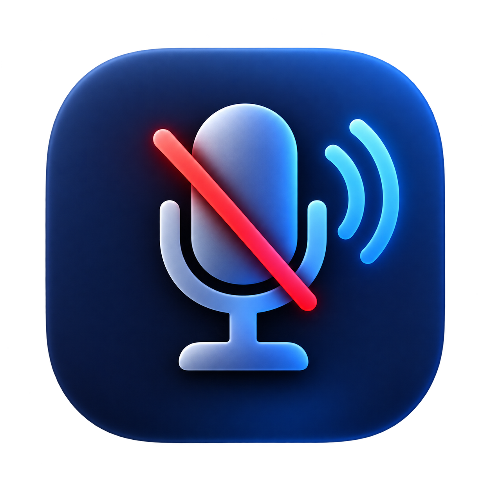
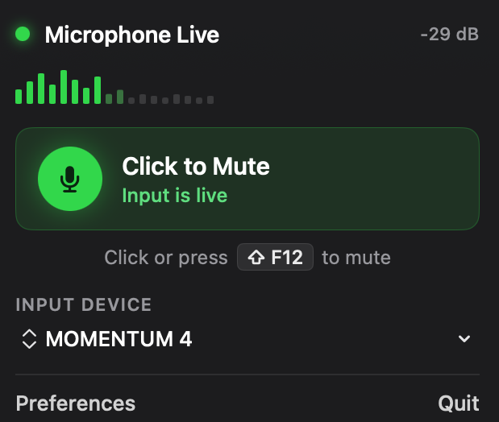
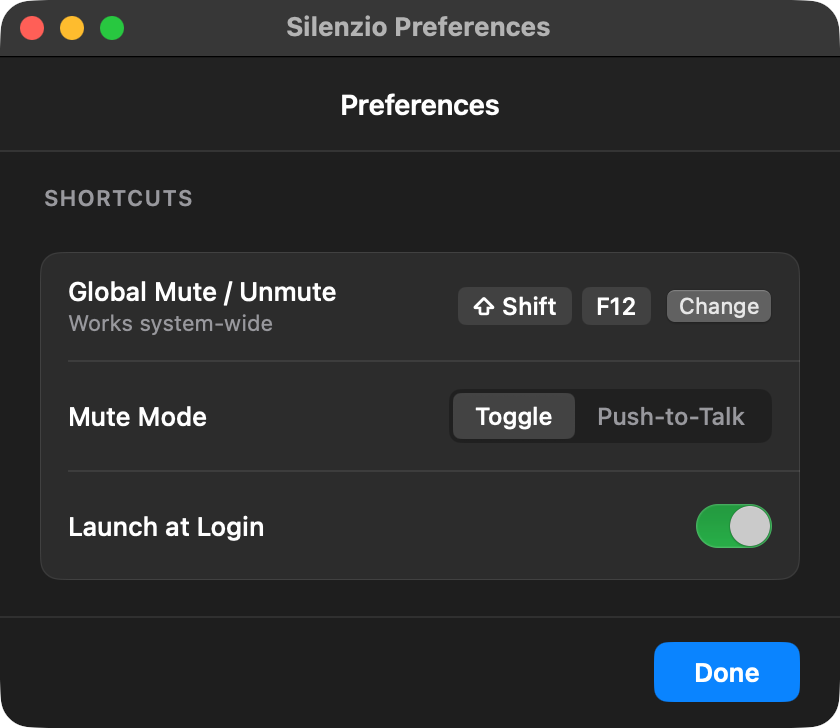

# Silenzio

<p align="center">
  
</p>

<p align="center">
  <strong>Mute your mic from the menu bar.</strong><br>
  A native macOS utility that lives in the status bar — no Dock icon, no main window.
</p>

<p align="center">
  
  
  
</p>

---

<p align="center">
  
  &nbsp;
  
</p>

## Features

- **One-click mute** — toggle the default input device from a compact menu bar popover
- **Global hotkey** — default **⌥ Space**, fully customizable
- **Toggle or Push-to-Talk** — hold the shortcut to speak, release to mute
- **Live input meter** — see levels and the active device at a glance
- **Mute HUD** — brief on-screen confirmation when mute state changes
- **Launch at login** — optional via System Settings integration
- **Agent app** — `LSUIElement`; stays out of the Dock and Cmd-Tab

## Requirements

- macOS 14 Sonoma or later
- Apple Silicon (`arm64`)
- [Xcode](https://developer.apple.com/xcode/) (for building from source)

## Install from source

```bash
git clone https://github.com/MadRay/Silenzio.git
cd Silenzio

chmod +x Scripts/package-app.sh Scripts/run.sh
./Scripts/package-app.sh
open dist/Silenzio.app
```

The packaged app is written to `dist/Silenzio.app` (ad-hoc signed so TCC prompts attach to the bundle).

For day-to-day development:

```bash
./Scripts/run.sh   # debug build + launch
```

> Microphone permission prompts only attach correctly when you launch the `.app` bundle — not the raw SwiftPM binary.

### Optional: point `xcode-select` at Xcode

```bash
sudo xcode-select -s /Applications/Xcode.app/Contents/Developer
```

Or set it for a single session:

```bash
export DEVELOPER_DIR=/Applications/Xcode.app/Contents/Developer
```

## Permissions

On first use, macOS may ask for:

| Permission | Why |
| --- | --- |
| **Microphone** | Live level meter in the popover |
| **Accessibility** | Reliable push-to-talk key-up detection |

Grant access to **Silenzio.app**, then click the menu bar icon again (or relaunch).

```bash
# Reset while debugging
tccutil reset Microphone com.silenzio.app
tccutil reset Accessibility com.silenzio.app
```

## Usage

| Action | How |
| --- | --- |
| Toggle mute | Click the mute button in the popover, or press the hotkey (**⌥ Space** by default) |
| Change shortcut | Preferences → Shortcuts → Change |
| Push-to-talk | Preferences → Mute Mode → Push-to-Talk |
| Preferences | Popover → Preferences, or **⌘,** |
| Quit | Popover → Quit, or **⌘Q** |

Status bar icon: `mic.fill` when live, `mic.slash.fill` (red) when muted.

## How it works

Silenzio mutes the **default input device** via CoreAudio:

1. Prefer `kAudioDevicePropertyMute` when the device supports it
2. Otherwise set volume to `0` and restore the previous level on unmute
3. Listen for hardware property changes so the icon stays in sync with System Settings and other apps

Built with SwiftUI (`MenuBarExtra`) and Swift Package Manager.

## Project layout

```
Package.swift
Resources/Info.plist
Scripts/package-app.sh
Scripts/run.sh
Sources/Silenzio/
  SilenzioApp.swift      # Menu bar agent app
  MicController.swift    # CoreAudio mute + meter
  HotkeyManager.swift    # Global hotkey + recorder
  SettingsStore.swift    # Preferences persistence
  Views/                 # Popover, Preferences, HUD
```

## License

[MIT](LICENSE) © 2026 Vic Danilov
